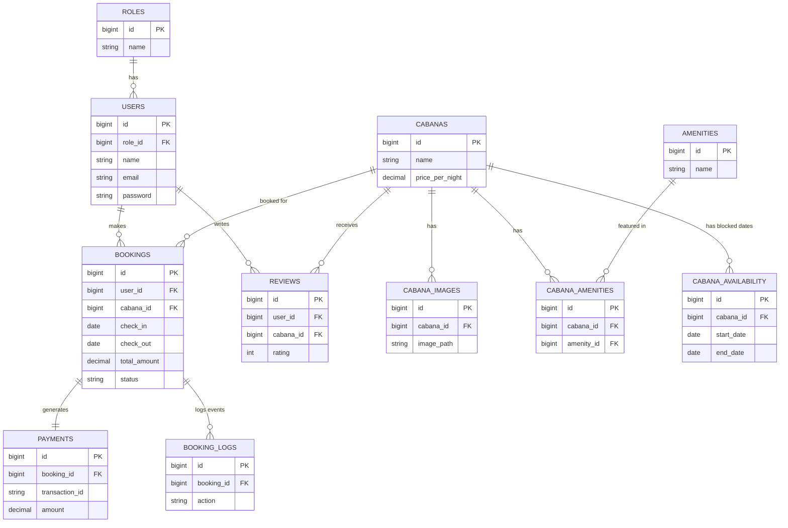

# Database Architecture and Schema Design
## Smart Online Cabana Booking and Management System

### 1. Database Overview
This document serves as the final, production-ready database blueprint for the Smart Online Cabana Booking and Management System. The architecture is a normalized relational database design that accommodates all core modules: authentication, cabana management, availability, bookings, payments, and reviews. Soft deletes are used to prevent destructive operations on critical historical records (like bookings and users).

---

### 2. Entity Relationship Diagram (ERD)



---

### 3. Table Structures

#### `roles`
* **Columns**: `id` (bigint), `name` (varchar), `timestamps`
* **Indexes**: Primary Key (`id`), Unique (`name`)

#### `users`
* **Columns**: `id` (bigint), `role_id` (bigint, FK), `name` (varchar), `email` (varchar), `password` (varchar), `phone` (varchar), `timestamps`, `softDeletes`
* **Indexes**: Primary Key (`id`), Unique (`email`)
* **Foreign Keys**: `role_id` references `roles(id)`

#### `cabanas`
* **Columns**: `id` (bigint), `name` (varchar), `description` (text), `price_per_night` (decimal 10,2), `max_guests` (int), `location` (varchar), `is_active` (boolean), `timestamps`, `softDeletes`
* **Indexes**: Primary Key (`id`)

#### `cabana_images`
* **Columns**: `id` (bigint), `cabana_id` (bigint, FK), `image_path` (varchar), `is_primary` (boolean), `timestamps`
* **Indexes**: Primary Key (`id`), Index (`cabana_id`)
* **Foreign Keys**: `cabana_id` references `cabanas(id)` ON DELETE CASCADE

#### `amenities`
* **Columns**: `id` (bigint), `name` (varchar), `icon` (varchar, nullable), `timestamps`
* **Indexes**: Primary Key (`id`)

#### `cabana_amenities` (Pivot Table)
* **Columns**: `id` (bigint), `cabana_id` (bigint, FK), `amenity_id` (bigint, FK)
* **Indexes**: Primary Key (`id`), Unique (`cabana_id`, `amenity_id`)
* **Foreign Keys**: `cabana_id` references `cabanas(id)` ON DELETE CASCADE, `amenity_id` references `amenities(id)` ON DELETE CASCADE

#### `cabana_availability` (Admin Blocked Dates)
* **Columns**: `id` (bigint), `cabana_id` (bigint, FK), `start_date` (date), `end_date` (date), `reason` (varchar), `timestamps`
* **Indexes**: Primary Key (`id`), Index (`cabana_id`), Index (`start_date`, `end_date`)
* **Foreign Keys**: `cabana_id` references `cabanas(id)` ON DELETE CASCADE

#### `bookings`
* **Columns**: `id` (bigint), `booking_ref` (varchar), `user_id` (bigint, FK), `cabana_id` (bigint, FK), `check_in` (date), `check_out` (date), `guests_count` (int), `total_amount` (decimal 10,2), `status` (enum: pending, confirmed, cancelled, completed), `timestamps`, `softDeletes`
* **Indexes**: Primary Key (`id`), Unique (`booking_ref`), Index (`check_in`, `check_out`), Index (`status`)
* **Foreign Keys**: `user_id` references `users(id)`, `cabana_id` references `cabanas(id)`

#### `payments`
* **Columns**: `id` (bigint), `booking_id` (bigint, FK), `transaction_id` (varchar, nullable), `amount` (decimal 10,2), `payment_method` (varchar), `status` (enum: pending, successful, failed, refunded), `timestamps`
* **Indexes**: Primary Key (`id`), Unique (`transaction_id`)
* **Foreign Keys**: `booking_id` references `bookings(id)` ON DELETE CASCADE

#### `reviews`
* **Columns**: `id` (bigint), `user_id` (bigint, FK), `cabana_id` (bigint, FK), `rating` (tinyint 1-5), `comment` (text, nullable), `is_approved` (boolean), `timestamps`
* **Indexes**: Primary Key (`id`), Index (`user_id`, `cabana_id`)
* **Foreign Keys**: `user_id` references `users(id)` ON DELETE CASCADE, `cabana_id` references `cabanas(id)` ON DELETE CASCADE

#### `booking_logs`
* **Columns**: `id` (bigint), `booking_id` (bigint, FK), `action` (varchar), `notes` (text, nullable), `created_at` (timestamp)
* **Indexes**: Primary Key (`id`)
* **Foreign Keys**: `booking_id` references `bookings(id)` ON DELETE CASCADE

---

### 4. Booking Validation Logic (Preventing Double Booking)

To definitively prevent overlapping bookings on a cabana, the availability check algorithm must evaluate whether the proposed `check_in` and `check_out` dates overlap with any existing records inside the `bookings` table (with standard reserved statuses) and the `cabana_availability` (admin blocked dates).

#### Overlap Algorithm Concept:
Two date ranges `[Start1, End1]` and `[Start2, End2]` overlap if and only if:
`Start1 < End2 AND End1 > Start2`

*(Note: Date logic usually considers Check-Out day as available for a new Check-In. The precise logic relies on strictly less-than/greater-than operators).*

#### Implementation Flow in Laravel:
```php
public function isCabanaAvailable($cabanaId, $checkIn, $checkOut)
{
    // 1. Check against Confirmed or Pending Bookings
    $hasBookingOverlap = Booking::where('cabana_id', $cabanaId)
        ->whereIn('status', ['pending', 'confirmed'])
        ->where(function ($query) use ($checkIn, $checkOut) {
            $query->where('check_in', '<', $checkOut)    // Existing checks-in before Requested checks-out
                  ->where('check_out', '>', $checkIn);   // Existing checks-out after Requested checks-in
        })->exists();

    if ($hasBookingOverlap) {
        return false;
    }

    // 2. Check against Admin Blocked Dates
    $hasAdminBlockOverlap = CabanaAvailability::where('cabana_id', $cabanaId)
        ->where(function ($query) use ($checkIn, $checkOut) {
            $query->where('start_date', '<', $checkOut)
                  ->where('end_date', '>', $checkIn);
        })->exists();

    if ($hasAdminBlockOverlap) {
        return false;
    }

    return true; // Dates are free to book
}
```
**Database level safety:** In extremely high-concurrency environments, pessimistic locking (`lockForUpdate()`) can be utilized immediately before finalizing a booking creation.

---

### 5. Laravel Migration Structures

Here are the migration blueprints representing the defined schemas.

```php
// roles
Schema::create('roles', function (Blueprint $table) {
    $table->id();
    $table->string('name')->unique();
    $table->timestamps();
});

// users
Schema::create('users', function (Blueprint $table) {
    $table->id();
    $table->foreignId('role_id')->constrained()->restrictOnDelete();
    $table->string('name');
    $table->string('email')->unique();
    $table->timestamp('email_verified_at')->nullable();
    $table->string('password');
    $table->string('phone')->nullable();
    $table->rememberToken();
    $table->timestamps();
    $table->softDeletes();
});

// cabanas
Schema::create('cabanas', function (Blueprint $table) {
    $table->id();
    $table->string('name');
    $table->text('description')->nullable();
    $table->decimal('price_per_night', 10, 2);
    $table->integer('max_guests');
    $table->string('location')->nullable();
    $table->boolean('is_active')->default(true);
    $table->timestamps();
    $table->softDeletes();
});

// cabana_images
Schema::create('cabana_images', function (Blueprint $table) {
    $table->id();
    $table->foreignId('cabana_id')->constrained()->cascadeOnDelete();
    $table->string('image_path');
    $table->boolean('is_primary')->default(false);
    $table->timestamps();
});

// amenities
Schema::create('amenities', function (Blueprint $table) {
    $table->id();
    $table->string('name');
    $table->string('icon')->nullable();
    $table->timestamps();
});

// cabana_amenities
Schema::create('cabana_amenities', function (Blueprint $table) {
    $table->id();
    $table->foreignId('cabana_id')->constrained()->cascadeOnDelete();
    $table->foreignId('amenity_id')->constrained()->cascadeOnDelete();
    $table->unique(['cabana_id', 'amenity_id']);
});

// cabana_availability
Schema::create('cabana_availability', function (Blueprint $table) {
    $table->id();
    $table->foreignId('cabana_id')->constrained()->cascadeOnDelete();
    $table->date('start_date');
    $table->date('end_date');
    $table->string('reason')->nullable();
    $table->timestamps();
    
    $table->index(['start_date', 'end_date']);
});

// bookings
Schema::create('bookings', function (Blueprint $table) {
    $table->id();
    $table->string('booking_ref')->unique();
    $table->foreignId('user_id')->constrained()->restrictOnDelete();
    $table->foreignId('cabana_id')->constrained()->restrictOnDelete();
    $table->date('check_in');
    $table->date('check_out');
    $table->integer('guests_count');
    $table->decimal('total_amount', 10, 2);
    $table->enum('status', ['pending', 'confirmed', 'cancelled', 'completed'])->default('pending');
    $table->timestamps();
    $table->softDeletes();
    
    $table->index(['check_in', 'check_out']);
    $table->index('status');
});

// payments
Schema::create('payments', function (Blueprint $table) {
    $table->id();
    $table->foreignId('booking_id')->constrained()->cascadeOnDelete();
    $table->string('transaction_id')->unique()->nullable();
    $table->decimal('amount', 10, 2);
    $table->string('payment_method')->default('PayHere');
    $table->enum('status', ['pending', 'successful', 'failed', 'refunded'])->default('pending');
    $table->timestamps();
});

// reviews
Schema::create('reviews', function (Blueprint $table) {
    $table->id();
    $table->foreignId('user_id')->constrained()->cascadeOnDelete();
    $table->foreignId('cabana_id')->constrained()->cascadeOnDelete();
    $table->tinyInteger('rating')->unsigned(); // 1-5
    $table->text('comment')->nullable();
    $table->boolean('is_approved')->default(true);
    $table->timestamps();
});

// booking_logs
Schema::create('booking_logs', function (Blueprint $table) {
    $table->id();
    $table->foreignId('booking_id')->constrained()->cascadeOnDelete();
    $table->string('action');
    $table->text('notes')->nullable();
    $table->timestamp('created_at')->useCurrent();
});
```

---

### 6. Model Relationships

These are the Eloquent relationships defined inside the Laravel Models:

**Role.php**
* `hasMany` Users

**User.php**
* `belongsTo` Role
* `hasMany` Bookings
* `hasMany` Reviews
* `isAdmin()` / `hasRole()` method utilizing the role relationship

**Cabana.php**
* `hasMany` CabanaImages (can define `hasOne` `PrimaryImage` via specific where clause)
* `belongsToMany` Amenities (through `cabana_amenities` pivot table)
* `hasMany` CabanaAvailability (Blocked Dates)
* `hasMany` Bookings
* `hasMany` Reviews

**Amenity.php**
* `belongsToMany` Cabanas

**CabanaImage.php**
* `belongsTo` Cabana

**CabanaAvailability.php**
* `belongsTo` Cabana

**Booking.php**
* `belongsTo` User
* `belongsTo` Cabana
* `hasOne` Payment
* `hasOne` Review (assuming one review per booking)
* `hasMany` BookingLogs (Tracking state changes like pending -> confirmed)

**Payment.php**
* `belongsTo` Booking

**Review.php**
* `belongsTo` User
* `belongsTo` Cabana
* `belongsTo` Booking (implied relation if linked to a specific stay)

**BookingLog.php**
* `belongsTo` Booking
